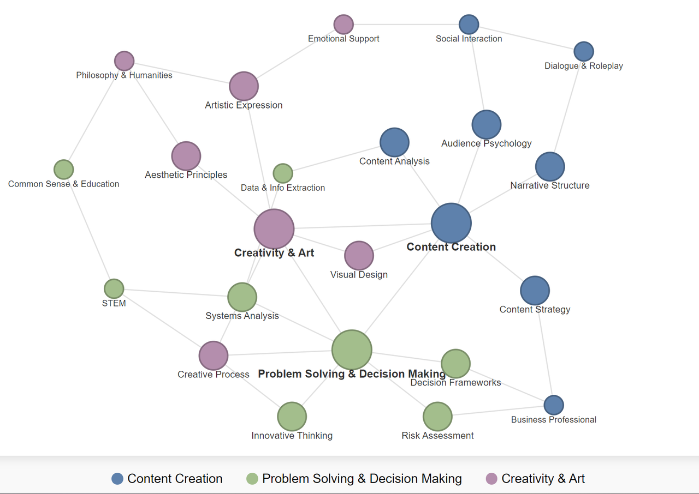
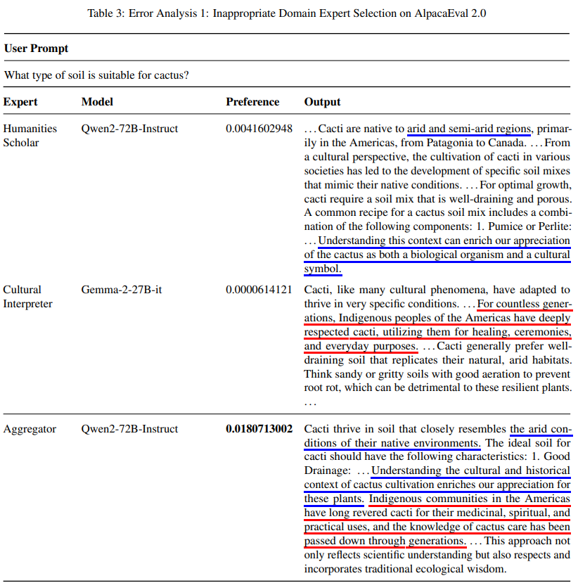

# Supplementary Materials for KABB: Knowledge-Aware Bayesian Bandits for Dynamic Expert Coordination in Multi-Agent Systems(774)

## Table S1: Ablation Study Results

  <table>
    <thead>
      <tr>
        <th>Method</th>
        <th>Win. (%)</th>
        <th>LC Win. (%)</th>
        <th>Cost per Instruction ($)</th>
        <th>RAS</th>
        <th>PWRS</th>
      </tr>
    </thead>
    <tbody>
      <tr>
        <td>KABB w/o Difficulty Scaling</td>
        <td>61.6</td>
        <td>60.1</td>
        <td>0.0015</td>
        <td>91.59</td>
        <td>58.53</td>
      </tr>
      <tr>
        <td>KABB w/o Semantic Matching</td>
        <td>59.9</td>
        <td>58.0</td>
        <td><b>0.0014</b></td>
        <td>89.37</td>
        <td>58.66</td>
      </tr>
      <tr>
        <td>KABB w/o Dependency Complexity</td>
        <td>62.7</td>
        <td>60.7</td>
        <td>0.0017</td>
        <td>91.67</td>
        <td>56.08</td>
      </tr>
      <tr>
        <td>KABB w/o Historical Effectiveness</td>
        <td>65.7</td>
        <td>62.1</td>
        <td>0.0016</td>
        <td>91.13</td>
        <td>58.46</td>
      </tr>
      <tr>
        <td>KABB w/o Team Complementarity</td>
        <td>63.1</td>
        <td>60.3</td>
        <td>0.0017</td>
        <td>92.32</td>
        <td>59.72</td>
      </tr>
      <tr>
        <td>EmbedLLM (MAB)</td>
        <td>62.9</td>
        <td>60.6</td>
        <td>0.0015</td>
        <td>93.03</td>
        <td>59.68</td>
      </tr>
      <tr>
      <td><b>KA (MAB) (i.e. KABB)</b></td>
      <td><b>66.7</b></td>
      <td><b>62.4</b></td>
      <td>0.0016</td>
      <td><b>94.16</b></td>
      <td><b>60.19</b></td>
      </tr>
    </tbody>
  </table>

## Table S2: Comparision with Other LLM Router Methods

<table>
<thead>
<tr>
<th>Method</th>
<th>Win. (%)</th>
<th>LC Win. (%)</th>
<th>Cost per Instruction ($)</th>
</tr>
</thead>
<tbody>
<tr>
<td>FrugalGPT</td>
<td>35.2</td>
<td>43.5</td>
<td><b>0.0005</b></td>
</tr>
<tr>
<td>EmbedLLM</td>
<td>41.4</td>
<td>48.0</td>
<td>0.0011</td>
</tr>
<tr>
<td>HybridLLM</td>
<td>38.8</td>
<td>45.4</td>
<td>0.0013</td>
</tr>
<tr>
<td><b>KABB (Ours)</b></td>
<td><b>66.7</b></td>
<td><b>62.4</b></td>
<td>0.0016</td>
</tr>
</tbody>
</table>

## Overview of KABB (Updated Figure 2 in Paper)

  

## Representative Visualization of Knowledge Graph

  

## Table S3: Error Analysis Case 1

  

## Table S4: Error Analysis Case 2

  

