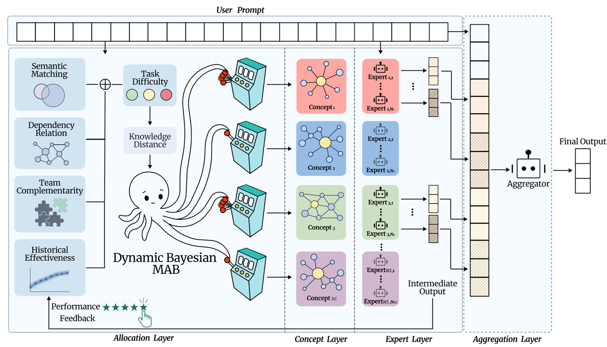
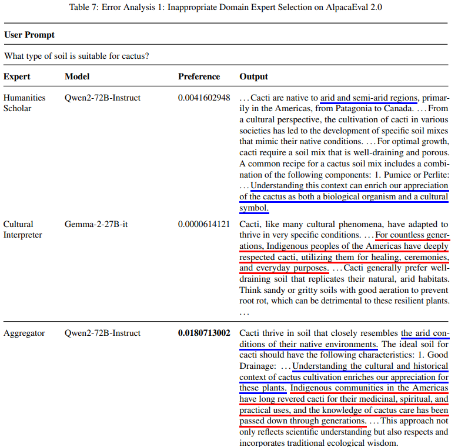
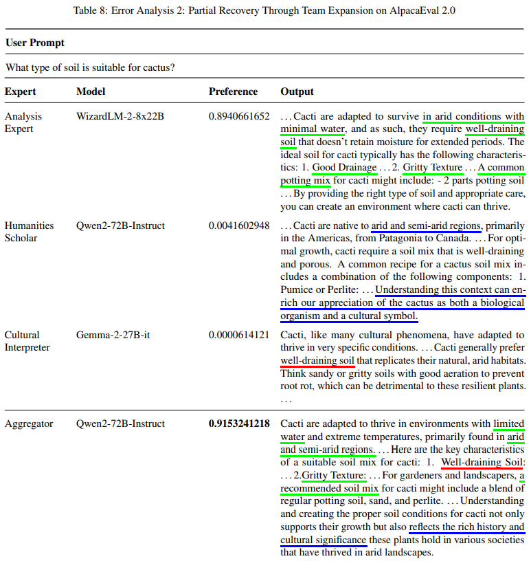

# Supplementary Materials for KABB: Knowledge-Aware Bayesian Bandits for Dynamic Expert Coordination in Multi-Agent Systems(774)

## Table1:Ablation Study Results

  <table>
    <thead>
      <tr>
        <th>Component</th>
        <th>Win Rate</th>
        <th>LC Win Rate</th>
        <th>Cost per instruction</th>
        <th>RAS</th>
        <th>PWRS</th>
      </tr>
    </thead>
    <tbody>
      <tr>
        <td>Difficulty scaling</td>
        <td>61.6</td>
        <td>60.1</td>
        <td>0.0015</td>
        <td>91.59</td>
        <td>58.53</td>
      </tr>
      <tr>
        <td>Semantic mismatch</td>
        <td>59.9</td>
        <td>58.0</td>
        <td>0.0014</td>
        <td>89.37</td>
        <td>58.66</td>
      </tr>
      <tr>
        <td>Dependency complexity</td>
        <td>62.7</td>
        <td>60.7</td>
        <td>0.0017</td>
        <td>91.67</td>
        <td>56.08</td>
      </tr>
      <tr>
        <td>Historical effectiveness</td>
        <td>65.7</td>
        <td>62.1</td>
        <td>0.0016</td>
        <td>91.13</td>
        <td>58.46</td>
      </tr>
      <tr>
        <td>Team complementarity</td>
        <td>63.1</td>
        <td>60.3</td>
        <td>0.0017</td>
        <td>92.32</td>
        <td>59.72</td>
      </tr>
      <tr>
        <td>EmbedLLM(MAB)</td>
        <td>62.9</td>
        <td>60.6</td>
        <td>0.0015</td>
        <td>93.03</td>
        <td>59.68</td>
      </tr>
      <tr>
        <td>Default</td>
        <td>66.7</td>
        <td>62.4</td>
        <td>0.0016</td>
        <td>94.16</td>
        <td>60.19</td>
      </tr>
    </tbody>
  </table>

## Table2:Comparision with Other LLM Router Methods

  <table>
    <thead>
      <tr>
        <th>Model</th>
        <th>Win Rate</th>
        <th>LC Win Rate</th>
        <th>Cost per instruction</th>
      </tr>
    </thead>
    <tbody>
      <tr>
        <td>FrugalGPT</td>
        <td>35.2</td>
        <td>43.5</td>
        <td>0.0005</td>
      </tr>
      <tr>
        <td>EmbedLLM</td>
        <td>41.4</td>
        <td>48.0</td>
        <td>0.0011</td>
      </tr>
      <tr>
        <td>HybridLLM</td>
        <td>38.8</td>
        <td>45.4</td>
        <td>0.0013</td>
      </tr>
      <tr>
        <td>KABB</td>
        <td>66.7</td>
        <td>62.4</td>
        <td>0.0016</td>
      </tr>
    </tbody>
  </table>

## Figure1:Updated Figure 2

  

## Figure2:Representative Visualization of Knowledge Graph

  

## Figure3:Error Analysis

  
  

